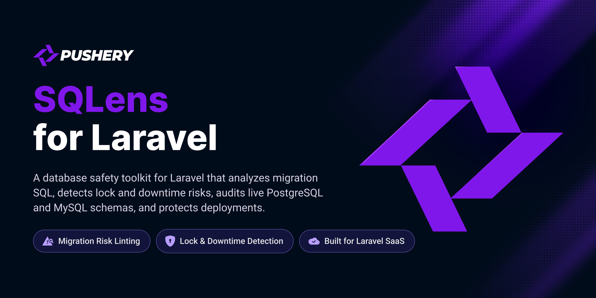

<p align="center">
  <a href="https://github.com/pushery/sqlens-for-laravel">
    
  </a>
</p>

# SQLens for Laravel

[](https://packagist.org/packages/pushery/sqlens-for-laravel)
[](https://packagist.org/packages/pushery/sqlens-for-laravel)
[](https://packagist.org/packages/pushery/sqlens-for-laravel)
[](LICENSE)

[](https://pestphp.com)


[](https://phpstan.org)
[](https://laravel.com/docs/pint)


SQLens — database safety toolkit for Laravel. It lints pending migrations for lock and downtime risk and audits the live schema, on PostgreSQL and MySQL.

SQLens for Laravel is a Composer package for Laravel applications on PostgreSQL 18+
and MySQL 8.4+. Other projects share the SQLens name; this one is the Laravel
database-safety toolkit published as `pushery/sqlens-for-laravel`, and it links to
none of them.

> The public API is documented and is what a 1.0 will commit to, but it is not frozen:
> a field or a flag may still change in a minor release before then.

## Why this exists

A migration that locks a table for four minutes is valid SQL. Nothing in Laravel
stops it, nothing in review reliably catches it, and the first sign is usually the
pager.

Tools that catch it exist, and none of them fits here. [Squawk](https://squawkhq.com)
reads `.sql` files and knows nothing about a Laravel migration, a `down()` method, or
the SQL the framework's grammar will actually emit — and it is PostgreSQL-only.
Atlas's `migrate lint` covered the general case and
[moved behind a paid plan in October 2025](https://atlasgo.io/versioned/lint), which is
what left the Laravel-and-MySQL corner empty rather than merely crowded.

So SQLens reads the SQL your migrations **actually emit**, on both engines, and
answers the questions a file of SQL cannot: does `down()` exist, does it really invert
`up()`, is the target database ready for this right now, and what did the migration
leave behind afterwards.

### Three principles, and every one of them is a test rather than a promise

- **No silent green.** Results are `pass`, `fail` or `undetermined` — and an
  `undetermined` names its reason. A check that could not run is never reported as one
  that passed.
- **Primum non nocere.** It reads catalogs and state views, sets its own session
  timeouts, and takes no lock of its own. It writes nothing to the database it is
  inspecting; the modes that must execute a migration to answer — `--shadow`,
  `--roundtrip`, and the expectation side of `sqlens:drift` — do it in a throwaway
  database they create and drop themselves, behind a guard that refuses outside
  `local` and `testing`. The debt ledger is a file in your repository, not a table in
  your schema.
- **Determinism.** The same state produces the same result, on a laptop and in CI.
  Held up by a pinned server version and a canonicalization layer — there is no fast
  path and correct path to choose between.

### The eight suites, one sentence each

| Suite | What it looks at |
| --- | --- |
| **lint** | The migrations you are about to run, before they reach a database. |
| **audit** | The schema that already exists, on a connection you name. |
| **security** | Roles, privileges, server settings and injection-shaped code — with a severity axis of its own. |
| **deploy** | The target database at deploy time, after the migration, and the drift in between. |
| **analyse** | The PHP that hands SQL to the database, through a PHPStan extension. |
| **format** | The `.sql` files in your repository, with a `--check` mode a CI step can act on. |
| **guard** | A running application, once you name a guard profile — and nothing until you do. |
| **agent** | The same engine, served to an agent: one prioritized fix document per run, an MCP server, and rules exported into the files your agents already read. |

Each has [its own documentation](https://docs.pushery.com/sqlens-for-laravel/), and each
says where it stops.

## Installation

```bash
composer require pushery/sqlens-for-laravel
```

PHP 8.4+, Laravel 12 or 13, PostgreSQL 18+ or MySQL 8.4+. The service provider registers
itself through package discovery, and there is nothing to migrate: SQLens ships no
tables and adds nothing to your schema.

```bash
php artisan sqlens:doctor --probe             # what SQLens can see from here
php artisan sqlens:lint --connection=pgsql    # the pending migrations, before they reach a database
php artisan sqlens:audit --connection=pgsql   # the live schema of the connection you name
```

Both name a connection above because a stock Laravel install defaults to SQLite, which SQLens
has no rules for — `sqlens:lint` follows your application default and will say so rather than
guess. Drop the flag from `sqlens:lint` once your default is the database you deploy against.

`sqlens:audit` needs the connection named whenever your `config/database.php` configures
more than one supported connection — which a stock Laravel install does. It will not pick
for you: which instance an audit reads is part of what its report asserts. Set
`sqlens.connection` once instead if the answer is always the same.

The [integration guide](https://docs.pushery.com/sqlens-for-laravel/integration-guide/)
walks the rest of the way — reading the first report, adopting on a project that already
has migrations, and wiring CI and the deploy gate.

## What it does

- **Reads the SQL your migrations actually emit**, rather than parsing the Blueprint
  calls that produced it — so a raw `DB::statement` is judged the same way a
  `Schema::table` is.
- **Answers in three values.** `pass`, `fail`, or `undetermined` with a named reason —
  and on a managed database, where much of the catalog is simply not exposed to any role
  you can hold, the third value is the normal answer rather than an edge case.
- **Never harms the database it inspects.** Catalog reads only, its own session
  timeouts, no locks of its own, and no writes at all — the debt ledger is a file in
  your repository, not a table in your schema.
- **Same state, same result**, on a laptop and in CI, held up by a pinned server
  version and a canonicalization layer rather than by convention.
- **Gates risk separately from strictness**, and says which of the two stopped a build —
  [below](#levels-severity-and-what-stops-a-build).
- **Classifies downtime on the findings that can cause it.** `online`, `blocking` or
  `rewrite`, so a deploy script can ask whether this release needs a maintenance window
  without knowing which rules carry the answer.
- **Tested against real PostgreSQL 18 and MySQL 8.4**, the databases Laravel Cloud
  runs, rather than against SQLite alone.
- **Says where it stops.** Every boundary — an analyzer it does not ship, a question a
  replica cannot answer, a tenant it will not pick for you — arrives as a named
  `undetermined` or a refusal, never as silence. See
  [Scope and limits](https://docs.pushery.com/sqlens-for-laravel/scope-and-limits/).

## What SQLens never asks for

Least privilege is the first thing to know about a tool you point at a production database, so it is
here rather than three pages in. None of these is a setting you configure — each is a property of
the code, and each is held by a test rather than by this paragraph.

- **No superuser.** Every reading works from an unprivileged role plus specific grants. On PostgreSQL
  that is the read-only built-in `pg_monitor`; on MySQL it is `PROCESS` and `REPLICATION CLIENT` plus
  `SELECT` on `performance_schema`.
- **No write access, and the seal is proved rather than assumed.** The session is sealed read-only
  and then attempts one write, requiring the server to refuse it. A session that accepted the write
  ends the run instead of continuing.
- **No access to your data.** Every query reads a catalog or a state view. No user table is selected
  from, no `EXPLAIN` is run, and no row contents reach a finding.
- **No locks of its own** — including the checks that are *about* locks. Proved from a SECOND
  connection, watching the server's own lock inventory while the reading's transaction is still
  open, on both PostgreSQL and MySQL. That is the moment the answer exists: once the read has
  rolled back there is nothing left to observe, and counting afterwards would only rule out a lock
  that survived rather than one taken and released.
- **No telemetry, and no opt-out to configure**, because there is nothing to opt out of.
- **No implicit network access.** Nothing is fetched at run time; the advisory data and the
  online-DDL matrix ship with the package. The one exception is
  `sqlens:security --refresh-advisories`, which fetches only because you typed it.

  The promise is held two ways, and the second is the one that would catch a supply-chain problem: a
  static scan over every shipped namespace, and a live run of the commands with a handler that
  counts every request ATTEMPTED — not merely completed. An attempt cannot be swallowed by an error
  path, and a request that never completes is never recorded.

  The scan's ground set is compared against the shipped tree rather than listed, so a namespace
  added tomorrow is covered without anybody remembering to add it.

## What it does need

One connection it may read, and — for `sqlens:predeploy` — a role of the `pg_monitor` class. The
copy-paste scaffold for both engines, which privilege each check needs, and what happens when one is
missing are on
[Predeploy permissions](https://docs.pushery.com/sqlens-for-laravel/predeploy-permissions/).

A privilege the role does not hold is never worked around by asking for a higher one. The affected
check reports `undetermined` with the privilege named, and the run says so — see
[Understanding undetermined](https://docs.pushery.com/sqlens-for-laravel/understanding-undetermined/).
That is the normal case on a managed database, not an error.

The single most effective thing you can do is give migrations and runtime separate connections;
[Read/write split](https://docs.pushery.com/sqlens-for-laravel/read-write-split/) shows the two-connection
setup. `sqlens:audit` runs as its own reader — see
[Audit role](https://docs.pushery.com/sqlens-for-laravel/audit-role/).

## Auditing a database that is not yours

If you are an agency or a consultant pointing SQLens at a **client's** database, get the
engagement in writing first — SQLens asks you nothing before it connects, and it cannot tell an
authorized audit from an unauthorized one.

[Auditing a database that is not yours](https://docs.pushery.com/sqlens-for-laravel/security/authorization/)
covers what an engagement should contain, which commands touch a foreign system at all — several never do — and what to bound from
the client's side. It is a documentation page rather than a
feature: nothing in the tool checks whether you were allowed to run it.

## Levels, severity, and what stops a build

Two gates run over the same findings, and they answer different questions. The **level** is an
appetite you turn up over time; the **security severity** is risk, and risk does not wait for a
project to feel ready. So a critical security finding stops a level-0 run — which is exactly where
it matters, because a project early in its adoption runs a low level.

The security gate has its own threshold, `sqlens.security.min_severity`, overridable per run with
`--min-severity`. The environment profiles preset it: `local` is the most permissive, `ci` and
`predeploy` are not. Every finding says which gate stopped it, and the two keep their own counts.

`--category` narrows a run to named categories. Scoping away from security is therefore a way to
turn the security gate off, and it is worth saying plainly rather than discovering: a category
filter that excludes security leaves nothing for that gate to stop. That is a decision available
to you, not a side effect.

### The exit codes are a contract, not an implementation detail

```
0  No finding breached a gate; the run is clean.
1  One or more findings breached the level or severity gate.
2  The configuration is invalid; nothing was audited.
3  A check was undetermined and strict mode escalated it to a failure.
```

One case does not reach SQLens at all: an option NAME the command does not know is rejected by
the console framework before the command runs, and that exits `1`. An unusable option VALUE —
`--min-severity=hgih` — is SQLens's own refusal and exits `2` as documented. Worth knowing if a
job branches on `1` without reading the message.

The third value is the one a two-valued world cannot express. **Without strict mode, an
`undetermined` check is reported and counted, never escalated** — the run stays on the three-valued
contract and tells you the number. Strict mode is what turns "I could not answer that" into a
failing build, and it is opt-in for exactly that reason.

### A suppressed finding is not a filtered one

Suppression stops a finding from blocking. It does not remove it from the report and does not
remove it from the counts — the run still says what was suppressed and by which source, so a
baseline cannot quietly become a way of not knowing. Four sources suppress, applied broadest
first: a repository baseline, a config ignore, an annotation in the migration itself, and the
opt-in that lets a project consent to destructive operations once instead of per migration.
Deduplication sits beside them rather than among them — it stops one problem from being reported
twice and suppresses nothing.

The counting semantics are shared across all of them, and that is the property worth relying on:
suppressed means not blocking, never invisible.

### What a minor version may change

A security severity **may be raised in a minor**, with a changelog callout — risk that is
understood late is still risk, and holding a correction until the next major would ship a number
the package knows to be wrong. Lowering a severity, renaming a rule id, or removing one is
breaking and waits. A rule id is never removed at all — a superseded rule is deprecated and goes
on answering the suppressions that name it, so a committed baseline stays readable across majors.
New rules arrive as `preview` and opt-in rather than in a minor's defaults;
[GOVERNANCE.md](GOVERNANCE.md) is the full contract.

## The security suite

`sqlens:security` examines a connection for security and privacy findings across every suite, rather
than adding a separate catalog of its own. It reads; it never grants, revokes or repairs.

```bash
php artisan sqlens:security
```

It reports in the formats the rest of the package reports in — `console`, `json`, `github`, `sarif`
and `agent` — and `--output` writes to a file instead of standard output:

```bash
php artisan sqlens:security --format=sarif --output=sqlens.sarif
```

SARIF is the format GitHub's code scanning ingests, which is what makes a finding show up on a pull
request rather than in a log nobody opens. The upload step and what it needs are on
[GitHub code scanning](https://docs.pushery.com/sqlens-for-laravel/security/github-code-scanning/).

The severity gate is the one described above: `--min-severity` sets the floor for the run, and the
profile presets it. Nothing about the security suite bypasses it.

### The privacy pack is opt-in, and off by default

Personal-data findings are a different question from security ones — they depend on what a column
MEANS, which is a judgment about the project rather than about the database. So they are their own
category and their own switch:

```php
// config/sqlens.php
'security' => [
    'privacy' => [
        'enabled' => true,
    ],
],
```

Leave it off and the suite says nothing about them. Turn it on and they arrive as ordinary findings
under the `privacy` category, subject to the same gate and the same suppression rules as everything
else.

The pack reads column NAMES and never values, so it produces questions rather than verdicts — and a
column it could not examine is reported as undetermined, not as clean.
[The privacy pack](https://docs.pushery.com/sqlens-for-laravel/security/privacy-pack/) is the page
that says what it can and cannot do, and states that this package makes no compliance claim.

### One command touches the network, and only when asked

`--refresh-advisories` fetches the end-of-life data the version checks read and writes it where this
package expects it:

```bash
php artisan sqlens:security --refresh-advisories
```

It needs a source to fetch from, and the package ships none: `sqlens.security.advisories.source`
is `null` by default, and without it the command refuses rather than inventing an endpoint to
trust. [Advisory data](https://docs.pushery.com/sqlens-for-laravel/advisory-data/) is where you
point it.

**It is the only thing here that opens a network connection, and it is never a side effect of a
check.** A run that did not ask for it works entirely from what is already on disk, and says so when
that data is old rather than quietly treating stale as current. Where the data comes from and how to
point it somewhere else is on
[Advisory data](https://docs.pushery.com/sqlens-for-laravel/advisory-data/).

### Outside tools, and the one that is deliberately absent

Two are adopted — Squawk for migration lint checks and the Postgres Language Server for schema-level
security ones. Both are optional, both are pinned to a measured version window, and neither is ever
assumed away: **a tool that is not installed produces an `undetermined` finding with a named reason,
never silence.**

One is deliberately not adopted. `plpgsql_check` finds interpolated `EXECUTE` inside PL/pgSQL bodies,
and it is a server extension rather than a binary — adopting it would mean installing it on the
server being audited and calling a checking routine there, which is a different act from reading a
catalog view. What watches that surface today, and why, is on
[Optional analyzers](https://docs.pushery.com/sqlens-for-laravel/tools/optional-analyzers/).

## Working with a coding agent

SQLens contains no model. It writes text for somebody else's agent and verifies, deterministically,
what that agent hands back — which is the half an agent cannot do for itself.

Two commands, one loop:

```bash
# Once, and again whenever the rules change: write the ACTIVE rule set into the
# context files your agents already read.
php artisan sqlens:agent-rules

# Every run: one markdown document an agent can act on without post-processing.
php artisan sqlens:lint --format=agent
```

If your project's default connection is SQLite — a common local default — name the connection you
actually deploy against: `--connection=pgsql`. SQLens has no rules for SQLite, so the command says
so and writes nothing rather than producing an empty catalog.

`sqlens:agent-rules` writes only files in your repository — no database is opened, so it runs in a
fresh clone and offline. It writes what your project ACTUALLY enforces at its configured level,
driver and version pin, not the full catalog: preventive guidance that named checks your pipeline
does not run would be wrong in the direction nobody notices.

The loop closes because both ends read the same decision. `--format=agent` reports the same gate and
exits with the same code as `--format=json`, so "the agent says it fixed it" is settled by a run
rather than by a claim.

Commit the generated files, then keep them honest in your own CI:

```yaml
- run: php artisan sqlens:agent-rules --check
```

`--check` writes nothing at all — including when the target file is missing, which is the state a
fresh clone is in and the one a write path would silently satisfy. Its exit codes are the package's
own contract: `0` current, `1` a deviation, `2` an option value it cannot use. A deviation and a
misconfiguration differ by number so a job can branch before it reads the message.

## Documentation

Everything — configuration, the strictness levels, every rule and why it exists —
lives at **[docs.pushery.com/sqlens-for-laravel](https://docs.pushery.com/sqlens-for-laravel/)**.

- [The integration guide](https://docs.pushery.com/sqlens-for-laravel/integration-guide/) — install, first run, adopting on an existing project, CI, and the deploy gate. Start here
- [The rule catalog](https://docs.pushery.com/sqlens-for-laravel/rules/) — one page per rule, and the target every finding's documentation URL points at
- [Outages on the record](https://docs.pushery.com/sqlens-for-laravel/incidents/) — documented incidents, the rules that bear on each, and the one SQLens would not have prevented
- [The lint suite](https://docs.pushery.com/sqlens-for-laravel/lint/) — levels, exit codes, CI wiring
- [Capture modes](https://docs.pushery.com/sqlens-for-laravel/capture-modes/) — pretend, shadow, and what each can prove
- [The catalog reader](https://docs.pushery.com/sqlens-for-laravel/catalog-reader/) — what it reads, what it never touches, the privileges it needs
- [Understanding `undetermined`](https://docs.pushery.com/sqlens-for-laravel/understanding-undetermined/) — the third value, and why it is not a warning
- [Conventions](https://docs.pushery.com/sqlens-for-laravel/conventions/) — rule ids, levels, and the axes they sit on
- [Scope and limits](https://docs.pushery.com/sqlens-for-laravel/scope-and-limits/) — what it checks, what it deliberately does not, and how it tells you which
- [Squawk parity](https://docs.pushery.com/sqlens-for-laravel/squawk-parity/) — every Squawk rule, and what SQLens does about it
- [The analyse suite](https://docs.pushery.com/sqlens-for-laravel/analyse/) — the PHPStan extension, and how it sits beside Larastan and phpstan-dba
- [The public API](https://docs.pushery.com/sqlens-for-laravel/public-api/) — what is promised from 1.0, what is explicitly not, and how a command becomes one or the other

## Squawk parity

SQLens treats [Squawk](https://squawkhq.com) as an amplifier rather than a competitor: where it
is installed, SQLens runs it over the same SQL it captured, maps the results into its own rules
and levels, and reports one finding where both saw one problem.

The [parity list](https://docs.pushery.com/sqlens-for-laravel/squawk-parity/) says where that
leaves every one of Squawk's rules — including the ones SQLens does not cover and the ones it
deliberately will not. It is generated from the map that ships with the package, so it cannot
quietly become a list of only the wins.

Run `php artisan sqlens:doctor` to see what SQLens found on this machine — the tools, their
versions, and for anything missing, how many checks nobody is running because of it.
`--format=json` gives the same facts in a stable shape a pipeline can assert on.

**It is never required.** Without Squawk installed, every SQLens rule still runs and the report
names what the extra checks would have added — so a run without it is a smaller report that says
so, not a quieter one. Squawk links `libpg_query` and ships no Windows build, so on Windows the
report names a platform reality rather than a missing install; the two read differently because
only one of them is an install away. Under `--strict-tools` a missing binary fails the run, a
platform that cannot have it does not, and `sqlens.tools.squawk.enabled = false` is a decision
rather than an absence and fails nothing.

## Security

Please review the [security policy](SECURITY.md) and report vulnerabilities
privately rather than opening a public issue.

## Built by Pushery

This package is built and maintained by [Pushery](https://www.pushery.com) — a
Berlin-based studio building Laravel applications, SaaS products, and open-source
tools.

Building a Laravel UI? [WireKit](https://wirekit.app), Pushery's open-source
Livewire component kit, gives you a polished component library out of the box.
Browse the rest of our work at [pushery.com](https://www.pushery.com).

## Governance

[GOVERNANCE.md](GOVERNANCE.md) is the contract behind the rules: what counts as
public API from 1.0, why a new rule arrives as `preview` rather than in a minor's
defaults, and the list of things SQLens never does.

## Trademarks

SQLens for Laravel is an independent, community package. Laravel is a trademark of
Laravel Holdings Inc.; SQLens is not affiliated with or endorsed by Laravel, and
uses the name only descriptively in the sense the Laravel trademark policy permits
("for Laravel"). PostgreSQL and MySQL are trademarks of their respective owners and
are named here only to describe the databases SQLens supports.

## License

The MIT License (MIT). See [LICENSE](LICENSE) for details, and
[NOTICE](NOTICE) for third-party attribution and the provenance of any data the
package bundles.
